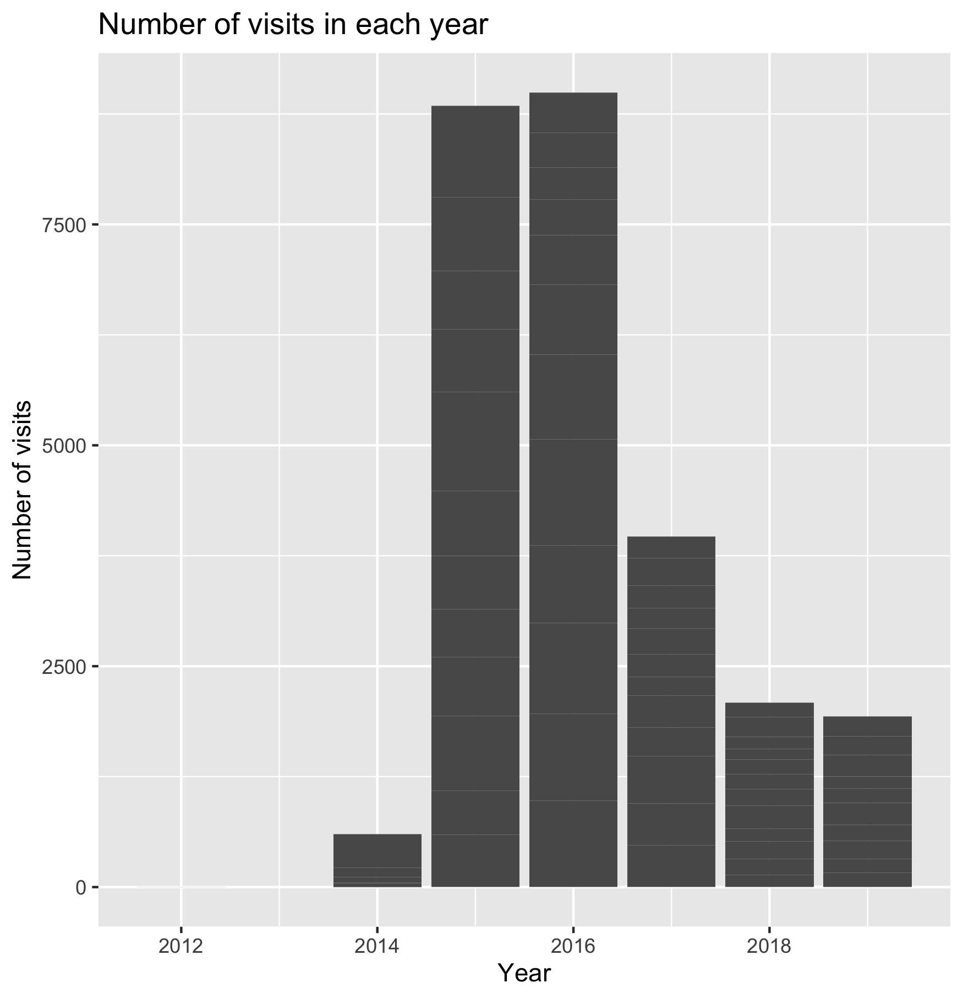
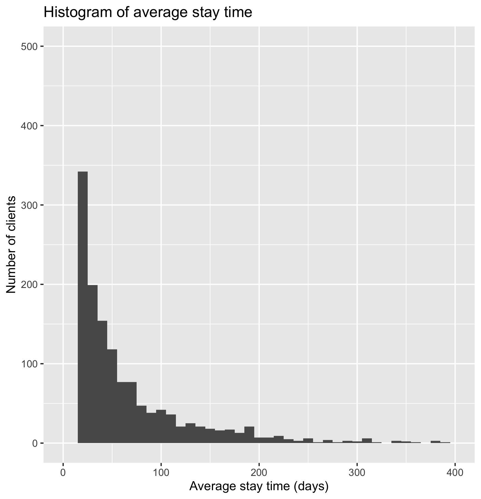
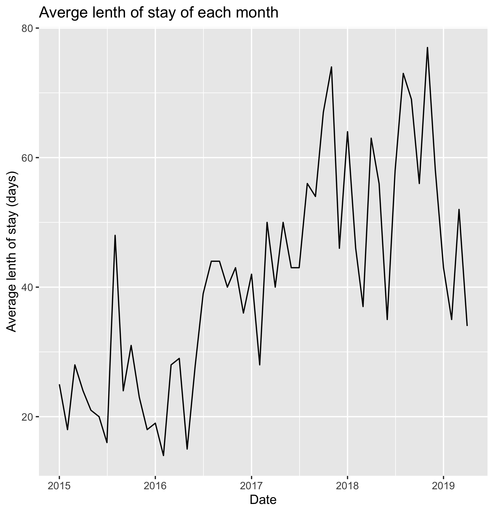
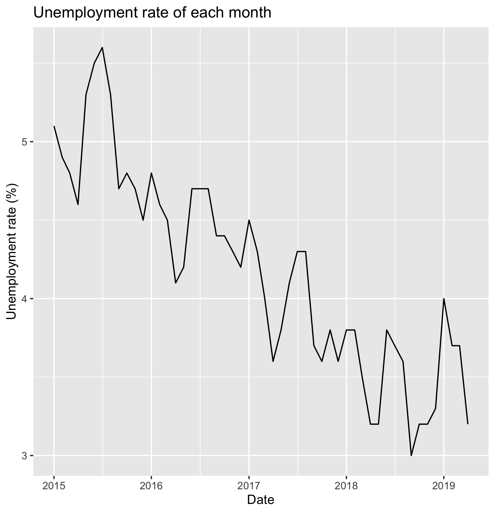
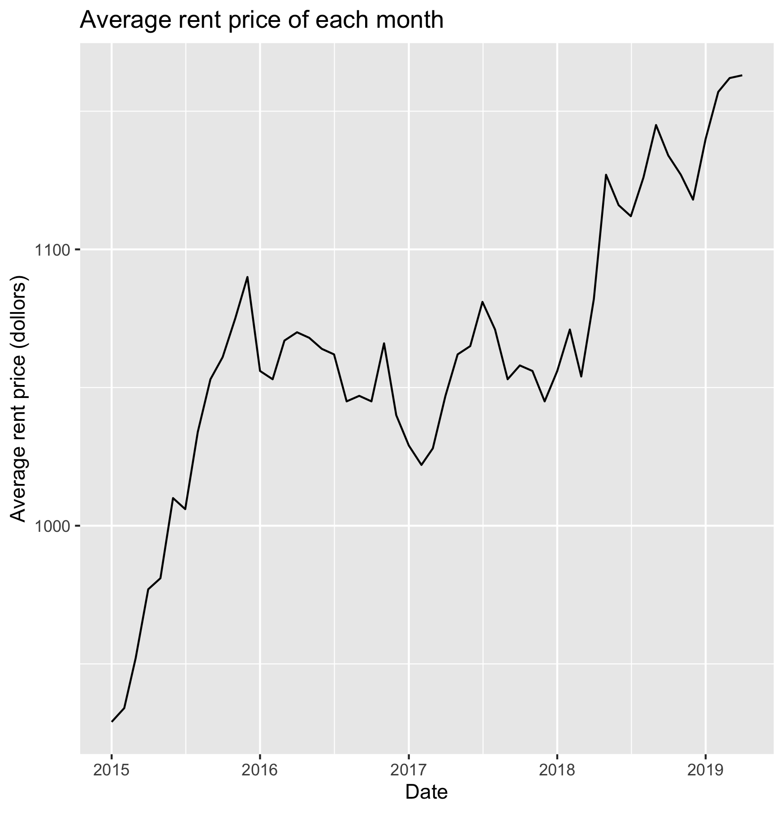

## Introduction

[UMD(Urban Ministries of Durham)](https://umdurham.org/) is a non-profit orgnization which connects with the community to end homelessness and fight poverty by offering food, shelter and a future to neighbors in need. [UMD's Community Shelter](https://umdurham.org/what-we-do/shelter.html) not only provides a shelter for homeless individuals and families, but also help them end homeless and provides them with a future by offering case management and workforce development. UMD provides the data about the imformation of each clients and the data they entry and exit the shelter. [FRED ECONOMIC DATA](https://fred.stlouisfed.org/series/DURH537URN) gives the umemployment rate in Durham from 1990 to 2019 (Source: U.S. Bureau of Labor Statistics). [Rent Jungle](https://www.rentjungle.com/average-rent-in-durham-rent-trends/) gives the average rent price in Durham from 2011 to 2019. Two processed dataframes are given in the results folder. The goal of this report is to analysis how is the average lenth of stay of each month related to local rent price and umemployment rate. 

## Results

Of the datatables provided bu UMD, I mainly use the [CLIENT_191102](https://raw.githubusercontent.com/biodatascience/datasci611/gh-pages/data/project2_2019/CLIENT_191102.tsv) and [ENTRY_EXIT_191102](https://raw.githubusercontent.com/biodatascience/datasci611/gh-pages/data/project2_2019/ENTRY_EXIT_191102.tsv).

We first plot how many records are there in each year.

From the plot we can see that the data mainly records visits from 2015 to 2019.

Then we plot the histogram of each client's average lenth of stay.

From the plot we can see that the longer the lenth of stay is, the smaller the number of clients. Most clients stay less than 50 days. But there are some clients stay more than six months.

At last, we plot the average lenth of stay, local unemployment rate and local rent price of each month from 2015 to 2019.9 to see how is lenth stay related to local unemployment rate and local rent price. From hypothesis, the higher the local unemployment rate and rent price, the longer the client stay.

We can tell from the plot that the average lenth of stay is about 25 days in 2015 except that it's very high (48 days) in August 2015. Then it starts to increase greatly from May to July in 2016. Then it keeps around 43 days from July 2016 to May 2017. Then increases again from May 2017 to November 2017. And vibrates greatly between 75 days and 40 days since November 2017 to September 2019.

In general, the unemployment rate keeps decreasing from 2015 to 2019.

From the plot we can see that the rent price keeps increasing from 900 to 1100 in 2015, then keeps still at about 1050 in 2016 and 2017, and then starts to increase again since 2018 to now.

## Conclusions
Therefore, we can see that in general the lenth of stay has little relationship with the unemployment rate. But it has a positive relationship with the local price. The higher the local price is, people are likely to stay longer.

